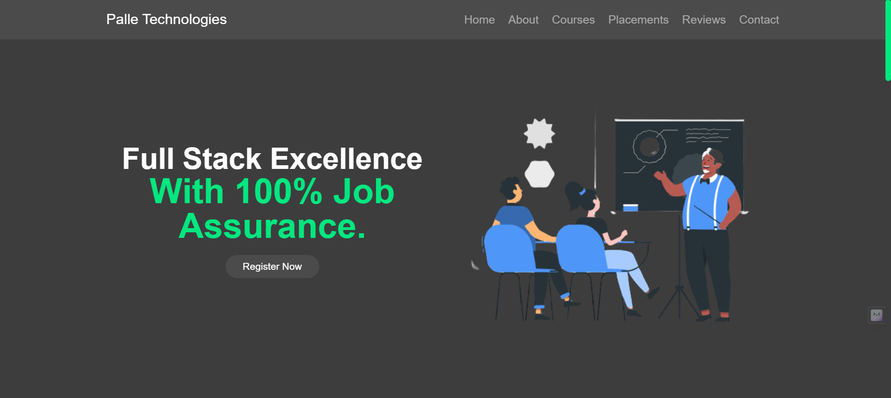

# Palle Technologies Educational Webpage

Welcome to the Palle Technologies Educational Webpage! This project is designed to provide comprehensive information about the courses offered at our institution.

## Table of Contents
- [About](#about)
- [Courses](#courses)
- [Technologies Used](#technologies-used)
- [Installation](#installation)
- [Usage](#usage)
- [Features](#features)
- [Contributing](#contributing)
- [License](#license)
- [Contact Information](#contact-information)

## About

The Palle Technologies Educational Webpage serves as a platform to showcase the courses we offer in full-stack development, both in Java and Python, as well as manual testing. This webpage provides detailed information about these courses, their content, and the opportunities they offer to students.

## Courses

### Full Stack Development in Java
- Description: A comprehensive course that covers Java-based full-stack development, including front-end and back-end technologies.
- [Course Details](java_full_stack.md)

### Full Stack Development in Python
- Description: Explore the world of full-stack development using Python, including popular frameworks and tools.
- [Course Details](python_full_stack.md)

### Manual Testing
- Description: Learn the essentials of manual testing, including test planning, execution, and defect management.
- [Course Details](manual_testing.md)

### Web Development
- Description: Dive into web development fundamentals, covering HTML, CSS, and JavaScript.
- [Course Details](web_development.md)

### MEAN/MERN Stack Development
- Description: Learn how to build web applications using MEAN (MongoDB, Express.js, Angular, Node.js) or MERN (MongoDB, Express.js, React, Node.js) stacks.
- [Course Details](mean_mern_stack.md)

### .NET Development
- Description: Master .NET development, covering the use of C# and associated tools for building Windows and web applications.
- [Course Details](dotnet_development.md)

### Manual Testing and Automation
- Description: Cover manual testing basics and explore automated testing using popular tools.
- [Course Details](testing_and_automation.md)

## Technologies Used

- HTML
- CSS
- JavaScript

We've leveraged these technologies to create an interactive and informative educational platform.

## Installation

To explore our educational webpage, you don't need to install anything. Simply visit [https://anoosh1234.github.io/EducationalWebpage/]

## Usage

Our webpage is easy to navigate. Explore the different course offerings, click on course details, and find the information you need.

We've used JavaScript to create an interactive slider section, making the user experience engaging. Our CSS styles have been carefully designed for a visually appealing interface.

## Features

- Detailed course information
- Interactive slider section
- Responsive and visually appealing design

## Contributing

We welcome contributions and suggestions. If you'd like to contribute to our project, please follow our [Contribution Guidelines](CONTRIBUTING.md). We value your input and ideas!

## License

This project is licensed under the MIT License. For more details, see the [LICENSE](LICENSE) file.

## Screenshots

## Contact Information

If you have any questions, suggestions, or need assistance, please don't hesitate to reach out to us:

- Email: contact@palletechnologies.com

We're here to help you on your educational journey!

---

© 2023 G Anoosh

